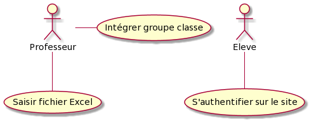
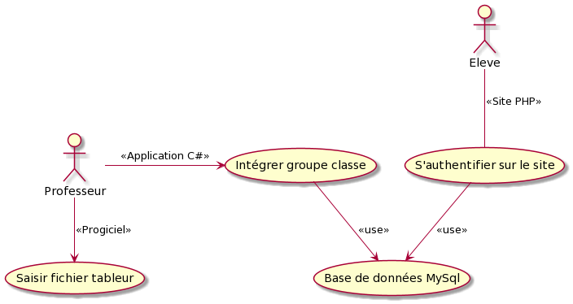
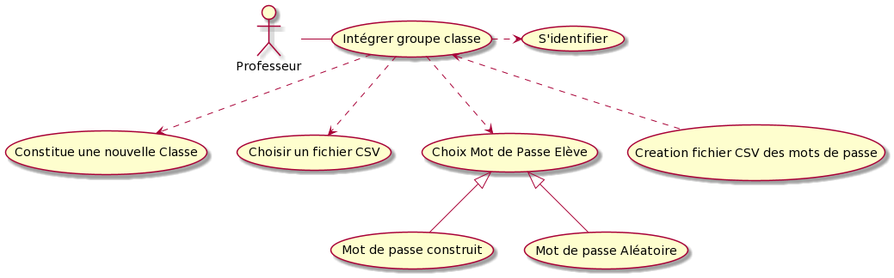
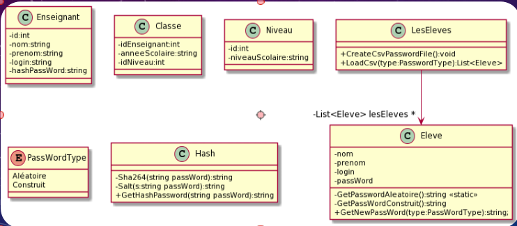
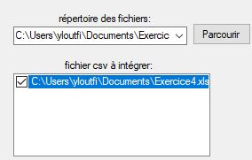
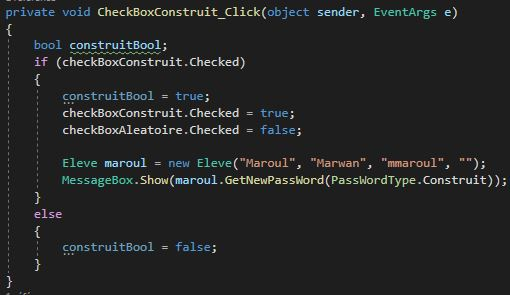
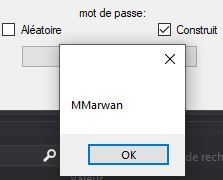
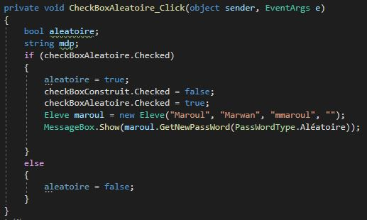
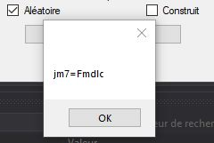

# 
 TP-RallyeLecture 

* [Presentation](#Presentation)
* [Outils](#Outils)
* [Diagramme de cas d'utilisation](#DiagrammeCasUtilisation)
* [Diagramme de cas de classe](#DiagrammeClasse)
* [Mot de passe construit](#MotDePasseConstruit)
* [Mot de passe Aleatoire](#MotDePasseAleatoire)
## Presentation
*** 
Le but de ce projet est la réation d’une solution qui permet d’inscrire une liste d’élèves entrés dans un tableur afin que ces derniers puissent se connecter au site web Rallye  Lecture

## Outils
***
* C#
* MySQL
* CodeIgniter

## DiagrammeCasUtilisation
***
Souhait |  Soltion proposé
:-------------------------:|:-------------------------:
| | 

## DiagrammeClasse 
***

## Interface
***

## MotDePasseConstruit
***
Code |  Interface
:-------------------------:|:-------------------------:
| | 

## MotDePasse
***
Code |  Interface
:-------------------------:|:-------------------------:
| | 

